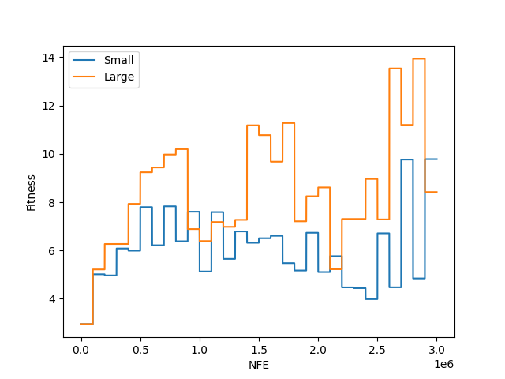

# dynopt

## Installation

Install the library with the following command:

```sh
pip install git+https://github.com/Y1fanHE/dynopt.git
```

## Problems

- [ ] Moving peak
- [x] Rotation peak
- [ ] Composition function

## Dynamics

- [x] Small
- [x] Large
- [x] Random
- [x] Chaotic
- [x] Recurrent
- [x] Noisy recurrent
- [x] Random Dimensional

## Usage

The following code evaluates the same solution with 30 changes on rotation peak with small and large dynamics.

```python
import numpy as np
from dynopt.rotation_peak import SmallRotationPeak, LargeRotationPeak
import matplotlib.pyplot as plt

srp = SmallRotationPeak()           # rotation peak with small change
lrp = LargeRotationPeak()           # rotation peak with large change
x = np.random.uniform(-5,5,srp.dim) # create a solution randomly

# evaluate the same solution for 30 changes
srp_fs = []
lrp_fs = []
for _ in range(srp.freq*30):
    f, x = srp.evaluate(x)
    srp_fs.append(f)
    f, x = lrp.evaluate(x)
    lrp_fs.append(f)

# plot fitness
plt.plot(srp_fs, label="Small")
plt.plot(lrp_fs, label="Large")
plt.xlabel("NFE")
plt.ylabel("Fitness")
plt.legend()
plt.show()
```


